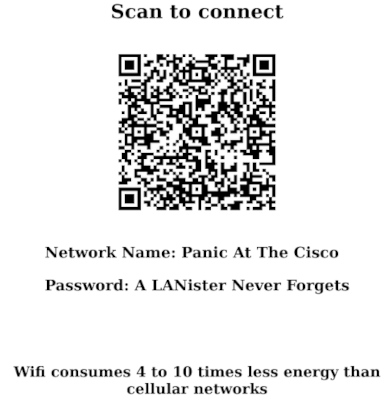

# Altertek QR Code Generator

  

`Use wifi, not 4G/5G !`

This repository contains the code for Altertek's online QR Code Generator.  
The goal is to encourage people to use wifi whenever possible instead of cellular networks.  
The information stating that wifi consumes 4 to 10 times less that cellar neworks comes from the French agency in charge of regulating telecommunications : [Link to the report](https://www.arcep.fr/uploads/tx_gspublication/reseaux-du-futur-empreinte-carbone-numerique-juillet2019.pdf)  

Features:  
- A fully static solution  
- A printer friendly output  
- PDF export throught the print function  

## Credits
Original work from @bibekkakati : https://github.com/bibekkakati/qr-gen

## Contributing
Contributions are welcome !  
Please see https://github.com/altertek/.github/blob/main/CONTRIBUTING.md
